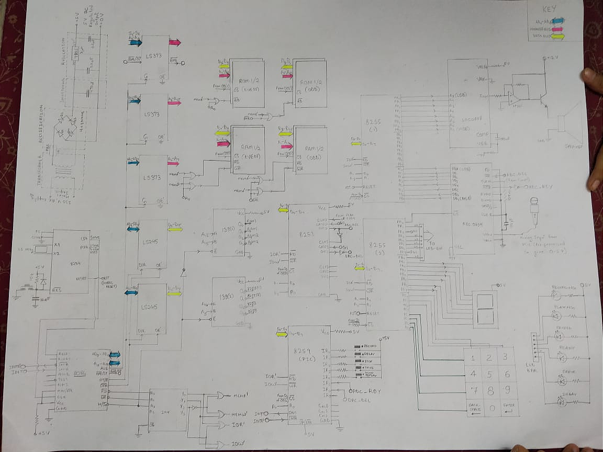

<h1 align="center">Voice Digitizer</h1>

Using an 8086 processor, a voice signal is to be recorded and reproduced.
Input is taken through a microphone, sampled and digitized by a 8-bit ADC at a frequency 1000 sample per second.
The digitized signal is to be stored in RAM. The signal for a period of
6 seconds has to be digitized. 
The voice stored has to be reproduced with delay when user closes a
switch labeled **sound replay**.
The delay to be entered by the user are numbers from 1-9, with the
help of a key-pad.  
The keypad has digits 0-9, backspace and enter.
A seven segment display has to be provided with the keypad to
display the delay value entered by the user.
The delay is between samples – If value entered in is 5 then delay
between two adjacent samples when reproduced is 5ms.

<h3> Software Used</h3>
<table>
<tr>
    <td><a href="https://www.labcenter.com/"> Proteus 8 </a></td>
    <td>To create the simulation</td>
</tr>
<tr>
    <td><a href="https://emu8086.en.lo4d.com/windows"> emu8086 </a></td>
    <td>To write and build bin file for assembly code</td>
</tr>
</table>

<h3>Files and Folders </h3>
Voice Digitizer.pdf - Documentation and report about the project 
Final - Directory containing proteus project file and source code for the final working demo. 
WorkADC - Directory contating project file and source code for a working ADC implementation.

<h3>Design </h3>

<h3>Demo </h3>

